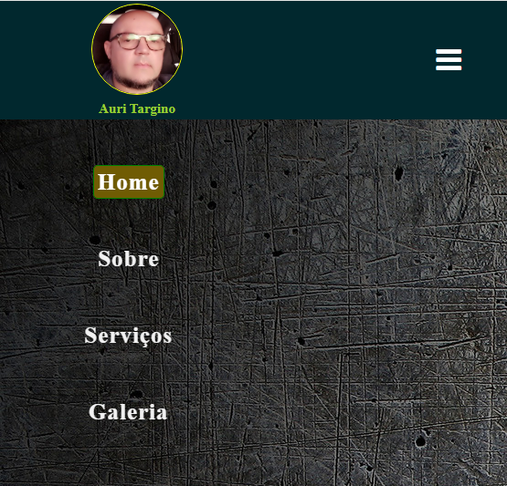

<h1 align="center"> Projeto  Menu Responsivo </h1>

Pojeto Menu Responsivo simples, aqual muito usado hoje em telas menores, celulares, tablet etc... 

  <a href="#-tecnologias">Tecnologias</a>&nbsp;&nbsp;&nbsp;|&nbsp;&nbsp;&nbsp;
  <a href="#-projeto">Projeto</a>&nbsp;&nbsp;&nbsp;|&nbsp;&nbsp;&nbsp;
  <a href="#-layout">Layout</a>&nbsp;&nbsp;&nbsp;|&nbsp;&nbsp;&nbsp;
  <a href="#memo-licença">Licença</a>

  

 

  

<a href="https://auritargino.github.io/Menu-Responsivo"> Abrir projeto  </a> 

##  Tecnologias

Esse projeto foi desenvolvido com as seguintes tecnologias:

- HTML e CSS
- JavaScript
- Git e Github
- Readme

## :memo: Licença

Esse projeto está sob a licença MIT.
---
Feito com ♥ por  Auri Targino : ( https://auritargino.github.io/Menu-Responsivo)